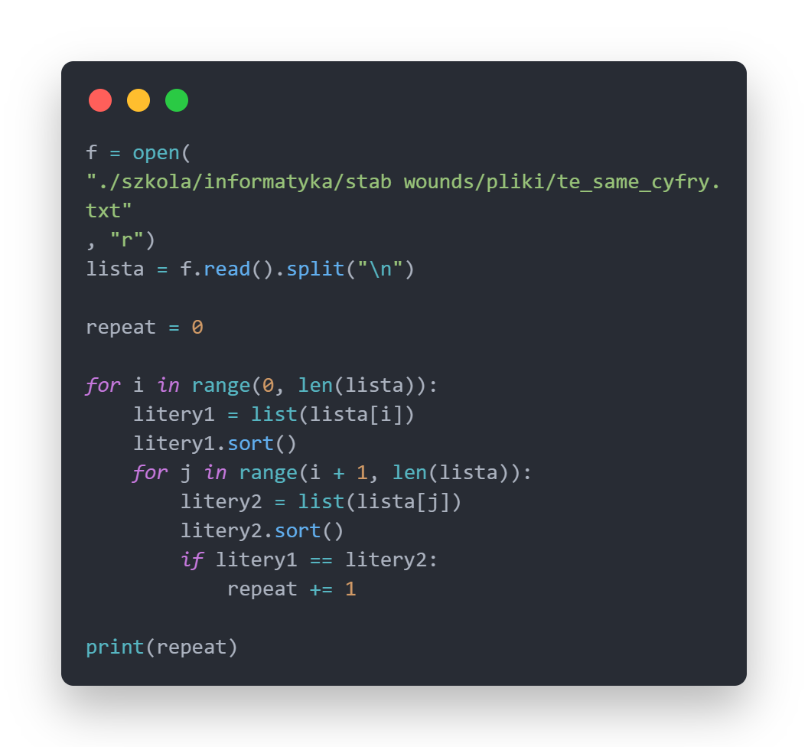

# Nagłówek
## Nagłówek
### Nagłówek
#### Nagłówek
##### Nagłówek
###### Nagłówek

---

Paragraf

*Pochylony*

**Pogrubiony**

~~przekreślony~~

1. Poniedziałek
2. Wtorek
3. Środa
4. Czwartek
5. Piątek
6. Sobota
7. Niedziela

- biały
- czarny
- szary

`function`

```py
#Python
for i in range (1,100):
    print(tak)
```
> cytat
> >zagnieżdżony blokkłote

[link do strony](https://gitlab.com/JDCombat)

[Link do nagłówka](#nagłówek)



| 1 jsnfdjklnajl | 2fsdfsdfsdfds | 3dfssfdsdf|
|:--- | :---:|---:|
|jfbdfhss | ksdnfj | fjsdbnf |

- [ ] Poniedziałek
- [ ] Wtorek
- [x] Środa
- [ ] Czwartek
- [ ] Piątek
- [ ] Sobota
- [ ] Niedziela

:joy:

:facepalm:

[//]: Komentarz

<details>
Kontent
</details>

---

**NOTE**

tak

---

<div style="page-break-after: always;"></div>

Bartosz Kozub 1P

- [Nagłówek](#nagłówek)
  - [Nagłówek](#nagłówek-1)
    - [Nagłówek](#nagłówek-2)
      - [Nagłówek](#nagłówek-3)
        - [Nagłówek](#nagłówek-4)
          - [Nagłówek](#nagłówek-5)

